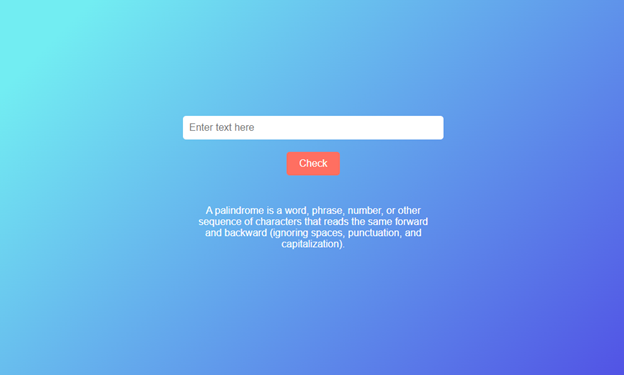

# PalindromeChecker
This is a palindrome Checker project;
#Project Title 🚀
palindrome checker

## Project Description 📝

"Farhat Sharefi's portfolio showcases a collection of projects, including a personal portfolio website and a technical documentation page. With a focus on simplicity and elegance, it provides a glimpse into Farhat's skills in web development and design."

## Demo 📸
[Live Demo]( https://iamfarhatsharefi.github.io/PalindromeChecker/)

## Technologies Used 🛠️

- HTML
<body>
    <input type="text" id="text-input" placeholder="Enter text here">
    <button id="check-btn">Check</button>
    

    
A palindrome is a word, phrase, number, or other sequence of characters that reads the same forward and backward (ignoring spaces, punctuation, and capitalization).

    
</body>

- CSS
#text-input {
  padding: 10px;
  border: none;
  border-radius: 5px;
  margin-bottom: 20px;
  width: 80%;
  max-width: 400px;
  font-size: 16px;
}

#check-btn {
  padding: 10px 20px;
  border: none;
  border-radius: 5px;
  background-color: #ff6f61;
  color: #fff;
  font-size: 16px;
  cursor: pointer;
  transition: background-color 0.3s;
}

-java script
document.getElementById('check-btn').addEventListener('click', function() {
    const inputElement = document.getElementById('text-input');
    const resultElement = document.getElementById('result');
    const inputValue = inputElement.value.trim();

## Installation 💻

Installation and Setup Instructions:
Clone the Repository:
git clone git@github.com:iamfarhatsharefi/PalindromeChecker.git
Navigate to the Project Directory:
cd PalindromeChecker

## Usage 🎯

Step 1: Find and Access the Repository
Navigate to the Repository:
Open your web browser and go to GitHub.
Use the search bar to find the repository you want to use, or navigate directly to the repository's URL.
Step 2: Clone the Repository
Copy the Repository URL:

On the repository's main page, click the green "Code" button.
Copy the URL 
Clone the Repository to Your Local Machine:
git@github.com:iamfarhatsharefi/PalindromeChecker.git

Open your terminal or command prompt.
Navigate to the directory where you want to clone the repository.
Replace repository with the name of the cloned repository

## Features ⭐
1.Real-time Palindrome Validation:

Instantly checks if the entered text is a palindrome upon clicking the "Check" button.
2.User-Friendly Input Field:

Clean and intuitive input area designed for easy text entry and improved user interaction.
3.Dynamic Feedback Display:

Provides immediate, clear feedback on whether the input text is a palindrome, enhancing user engagement.
4.Educational Definition Section:

Includes a concise and informative definition of a palindrome, helping users understand the concept directly within the application.
5.Responsive Design:

Fully responsive layout ensures optimal usability and appearance across all devices, including desktops, tablets, and smartphones.
6.Modern and Appealing UI:

Stylish and modern user interface with smooth gradients and cohesive color schemes that enhance visual appeal.

## Author 👩‍💻
[Linkedin](https://www.linkedin.com/in/farhat-sharefi-13a101309?utm_source=share&utm_campaign=share_via&utm_content=profile&utm_medium=android_app)
- [Email](sharefifarhat@gmail.com)